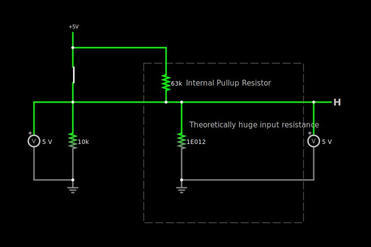
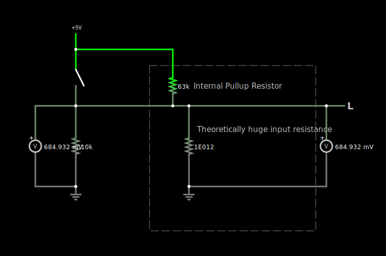

MAX6818-debouncing-circuit
==========================
I did everything wrong. MAX6818 pulled up the buttons with internal pullup resistors.
- [MAX6818-Based Debounced Breadboard Keypad | The Life of Kenneth](https://blog.thelifeofkenneth.com/2011/09/max6818-based-debounced-breadboard.html)

### Solution
- Add pull down resistors (Use voltage divider equation to get the best resistence value, i blindly used 10k) to **internally pullup-ed (according to datasheet it is typically 63k resistor)** input pins ([Circuit JS file](./circuit-20241113-2108.circuitjs.txt))

### Before knowing i was wrong

### The [circuit](circuit-20240205-1915.circuitjs.txt) for [Circuit JS/Falstad](https://www.falstad.com/circuit/circuitjs.html)

### Output
 
 

### Notes
- Three-state Enable(Active Low, Pin 1) may be unneeded, if this is true, switches may omit the 5V supply (see [datasheet](max6816-max6818.pdf)'s page 1, untested)
  - Answers
    - It is needed. Active Low should be used (that is connected to the `GND` aka `low`) to let the chip operate (aka to enable it). that in javascript: `MAX6818 is enabled = !!GND`
    - Active Low has nothing to do with power supply. it is just a enable / disable pin

### Related
- [dirkarnez/EIE3105_Debounce_Test](https://github.com/dirkarnez/EIE3105_Debounce_Test)
